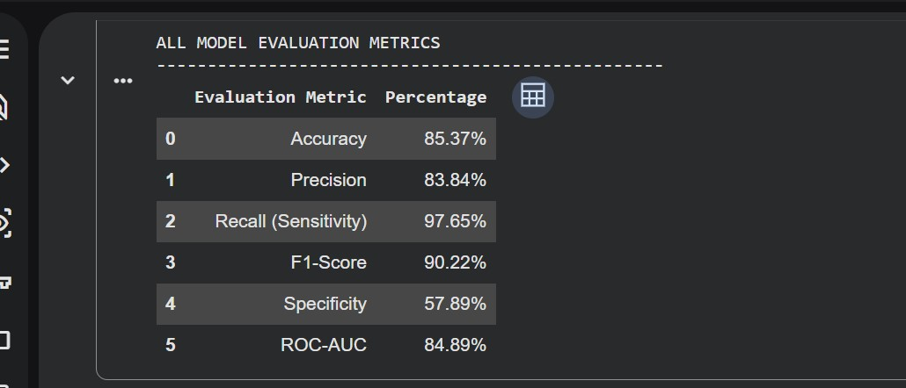
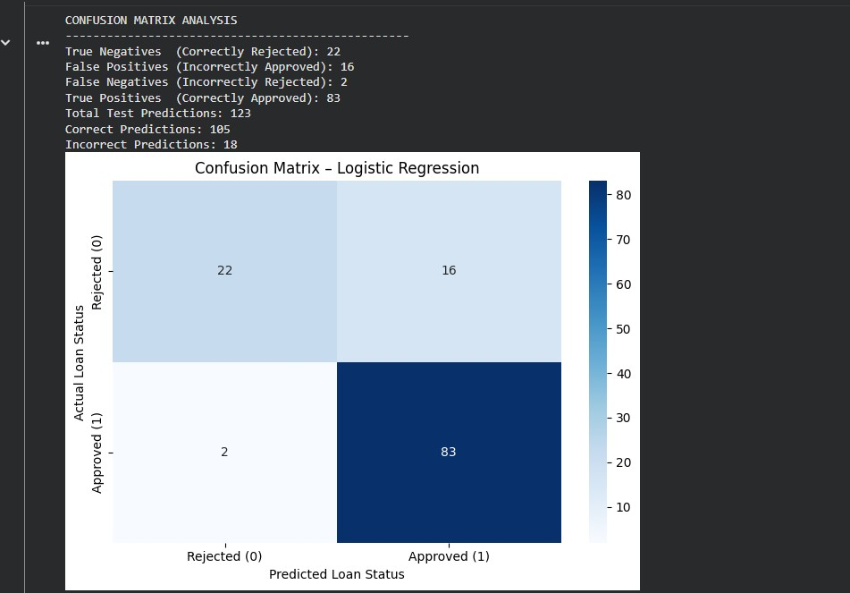
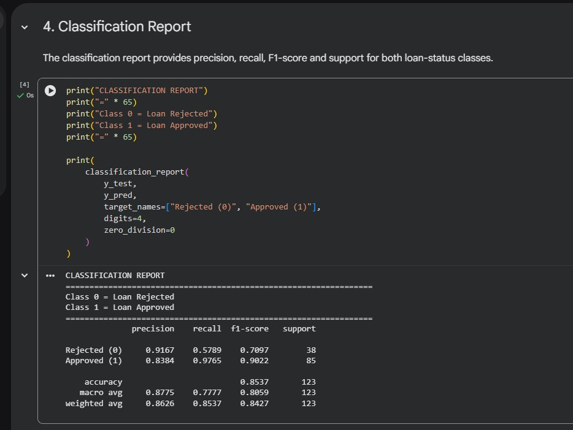
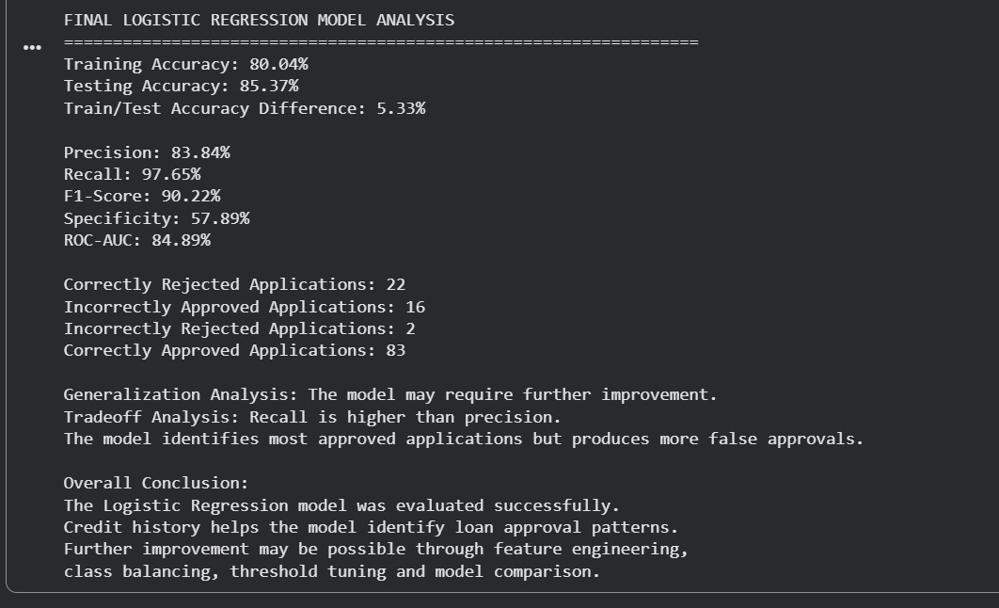

# Loan Approval Prediction System

An end-to-end Machine Learning project that predicts whether a loan application is likely to be approved or rejected. The project uses Logistic Regression and provides prediction probabilities through an interactive Gradio web application.

## Project Overview

Financial institutions receive many loan applications and need to evaluate applicants consistently. This project uses applicant information such as income, credit history, education, employment status, loan amount and property area to predict loan approval.

The target variable is `Loan_Status`:

- `0` = Loan Rejected
- `1` = Loan Approved

## Dataset

- Dataset Source: Kaggle Loan Prediction Dataset
- Original Dataset Shape: 614 rows and 13 columns
- Prepared Dataset Shape: 614 rows and 14 columns
- Target Variable: `Loan_Status`
- Missing Values After Cleaning: 0
- Duplicate Records: 0

## Features Used

The following applicant features are used by the model:

- Gender
- Married
- Dependents
- Education
- Self Employed
- Applicant Income
- Coapplicant Income
- Loan Amount
- Loan Amount Term
- Credit History
- Property Area

## Data Cleaning and Preprocessing

The following preprocessing steps were performed:

1. Inspected the dataset for missing values.
2. Checked the dataset for duplicate records.
3. Filled missing categorical values using the mode.
4. Filled missing numerical values using the median.
5. Removed the `Loan_ID` column because it does not contribute to prediction.
6. Converted binary categorical variables into numerical values.
7. Applied one-hot encoding to the Property Area column.
8. Converted the target variable into numerical form.
9. Verified that no missing values remained.
10. Saved the prepared dataset as `cleaned_loan_approval_dataset.csv`.

## Exploratory Data Analysis

Exploratory Data Analysis was performed using statistical summaries, relationship analysis and visualizations.

### Important Observations

- The dataset contains 614 loan applications.
- 422 applications were approved.
- 192 applications were rejected.
- The overall loan approval rate was 68.73%.
- Applicants with good credit history had a 79.05% approval rate.
- Applicants with poor credit history had only a 7.87% approval rate.
- Credit history had the strongest relationship with loan approval.
- Income and loan amount alone did not determine the final approval decision.
- Graduate applicants showed a higher approval rate than non-graduate applicants.
- Employment status had a relatively weak relationship with loan approval.

## Model Selection

Logistic Regression was selected because loan approval is a binary classification problem.

The model predicts:

- Loan Rejected (`0`)
- Loan Approved (`1`)
- Approval probability
- Rejection probability

A Scikit-learn Pipeline was used to combine feature scaling and Logistic Regression.

## Train and Test Split

The prepared dataset was divided using an 80/20 stratified split:

- Training Records: 491
- Testing Records: 123
- Training Size: 80%
- Testing Size: 20%
- Random State: 42

## Model Evaluation Results

| Evaluation Metric | Result |
|---|---:|
| Training Accuracy | 80.04% |
| Testing Accuracy | 85.37% |
| Precision | 83.84% |
| Recall (Sensitivity) | 97.65% |
| F1-Score | 90.22% |
| Specificity | 57.89% |
| ROC-AUC | 84.89% |

## Confusion Matrix Results

| Prediction Result | Number |
|---|---:|
| True Negatives | 22 |
| False Positives | 16 |
| False Negatives | 2 |
| True Positives | 83 |
| Correct Predictions | 105 |
| Incorrect Predictions | 18 |

The model achieved a high recall of 97.65%, which means it successfully identified most approved loan applications. However, its lower specificity indicates that some rejected applications were incorrectly classified as approved.

## Loan Prediction Application

An interactive user interface was developed using Gradio. The application allows users to enter applicant information and receive:

- Loan approval or rejection prediction
- Approval probability
- Rejection probability
- Probability-based explanation

The trained Logistic Regression pipeline is stored in:

`loan_approval_logistic_model.pkl`

## Application Test Cases

Multiple unseen applicant profiles were tested successfully.

### Test Case 1 — Applicant with Good Credit History

The first applicant was predicted as approved.

- Approval Probability: 88.41%
- Rejection Probability: 11.59%
- Final Prediction: Loan Approved

### Test Case 2 — Applicant with Poor Credit History

The second applicant was predicted as rejected.

- Approval Probability: 3.24%
- Rejection Probability: 96.76%
- Final Prediction: Loan Rejected

### Test Case 3 — Additional Unseen Applicant

The third unseen applicant was predicted as approved.

- Approval Probability: 82.14%
- Rejection Probability: 17.86%
- Final Prediction: Loan Approved

## Screenshots

### Loan Prediction Application


### Multiple Applicant Test Results


### Model Evaluation Metrics



### Confusion Matrix



### Classification Report



### Final Model Analysis



## Technologies Used

- Python
- Pandas
- NumPy
- Scikit-learn
- Matplotlib
- Seaborn
- Gradio
- Joblib
- Google Colab
- Git
- GitHub

## Project Structure

```text
loan-approval-prediction/
│
├── app.py
├── cleaned_loan_approval_dataset.csv
├── loan_approval_logistic_model.pkl
├── requirements.txt
├── README.md
│
├── notebooks/
│   └── Project notebooks
│
└── screenshots/
    └── Project screenshots
```

## Installation and Local Execution

Clone the GitHub repository:

```bash
git clone https://github.com/Rafay-Baloch/loan-approval-prediction.git
```

Open the project directory:

```bash
cd loan-approval-prediction
```

Install the required Python libraries:

```bash
pip install -r requirements.txt
```

Run the Gradio application:

```bash
python app.py
```

After running the command, open the local Gradio URL displayed in the terminal.

## Limitations

- The dataset contains only 614 records.
- The model is trained on a limited number of applicant features.
- The model has lower specificity than recall.
- Some rejected applications may be incorrectly classified as approved.
- The model may not represent every real-world financial situation.
- The application is developed for educational purposes and should not be used as the only basis for real financial decisions.

## Future Improvements

- Use a larger and more diverse dataset.
- Compare Logistic Regression with Random Forest and other classification algorithms.
- Perform advanced feature engineering.
- Apply class-balancing techniques.
- Tune the classification decision threshold.
- Improve rejection-class prediction.
- Add secure data storage and authentication.
- Deploy an improved production-ready version.

## Disclaimer

This project was developed for educational and internship purposes only. Its predictions should not be considered official financial or loan approval decisions.

## Author

**Abdur Rafay Hassan Baloch**

- GitHub: [Rafay-Baloch](https://github.com/Rafay-Baloch)
- LinkedIn: [Abdur Rafay Hassan Baloch](https://www.linkedin.com/in/abdur-rafay-hassan-baloch-0860b9225/)